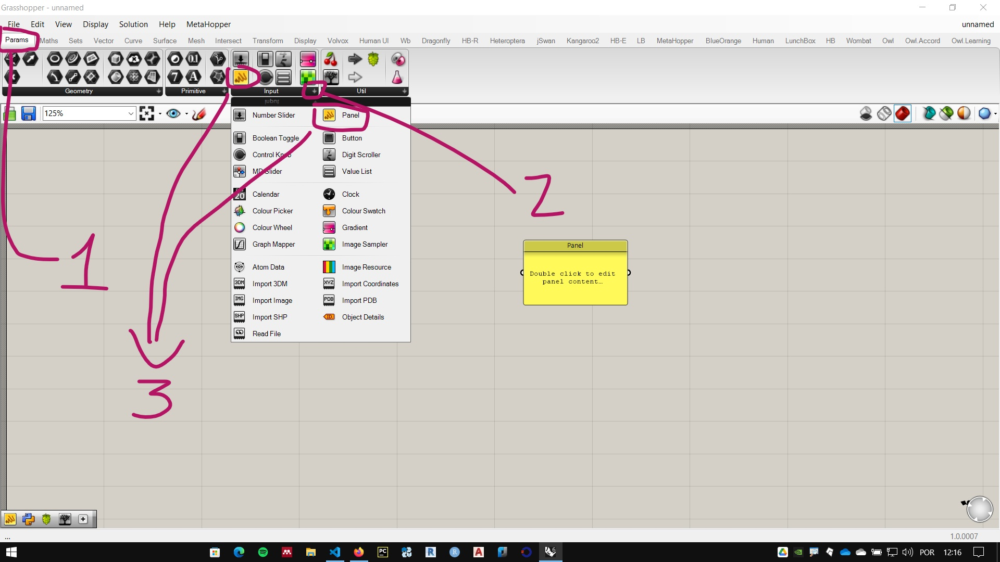
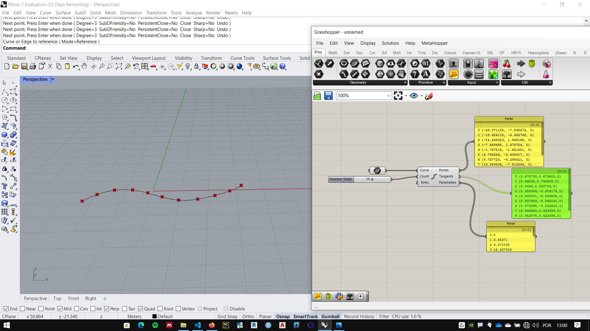
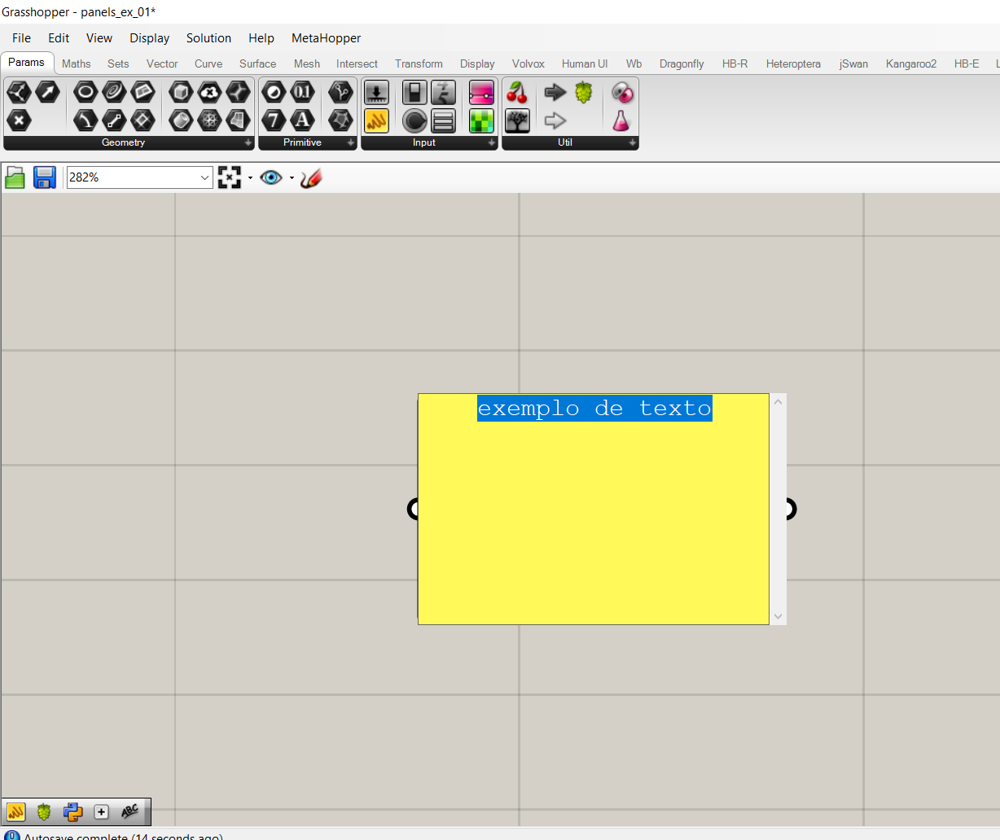
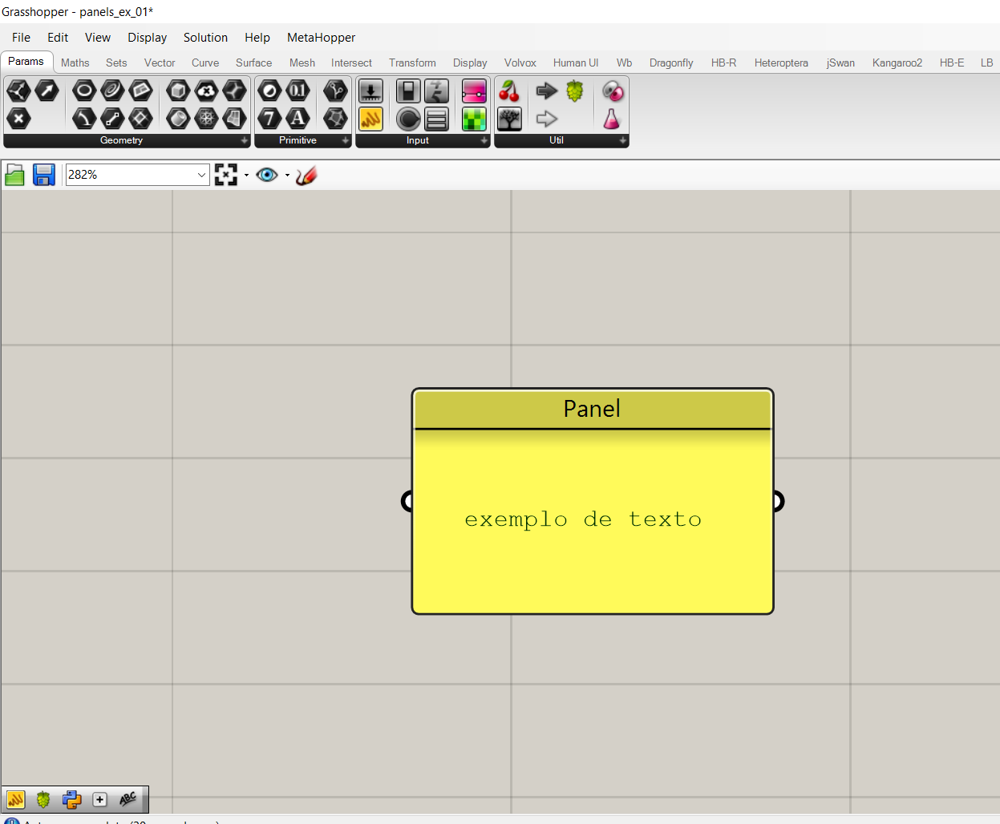
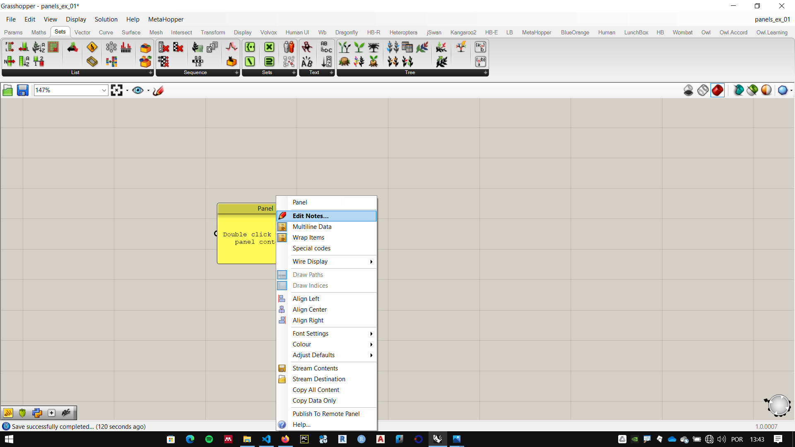
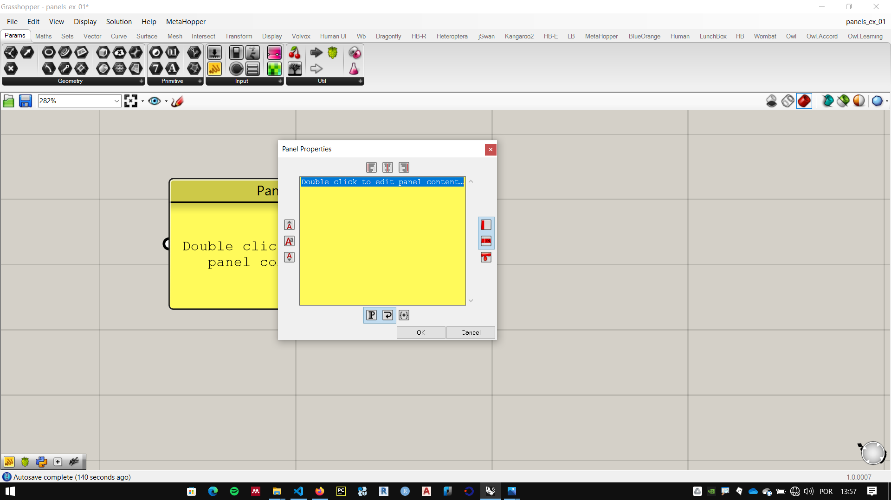
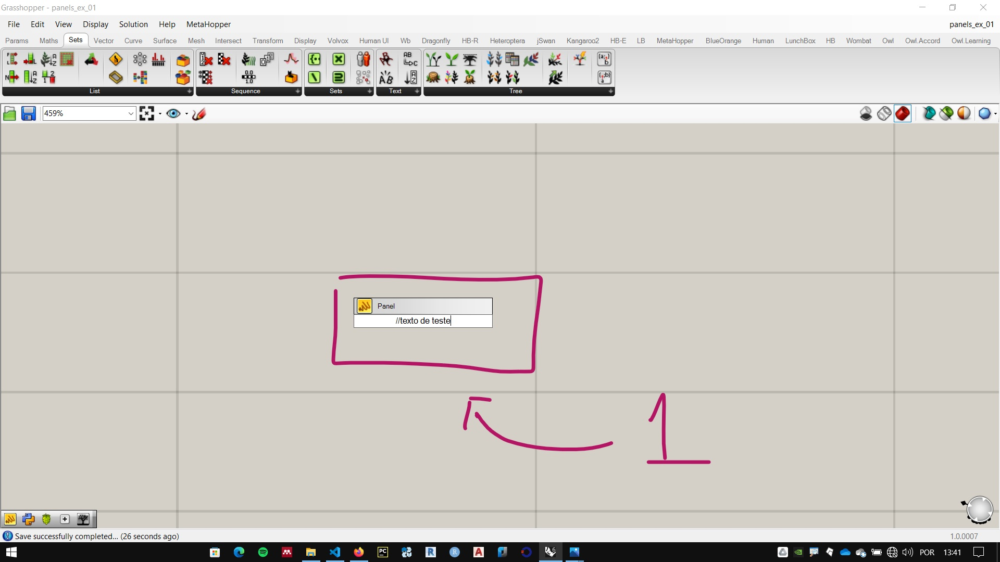
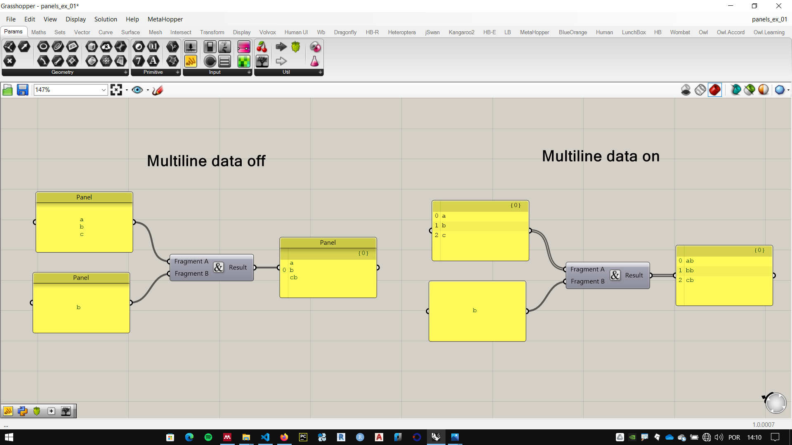

# Panels : O que é são, onde vivem e o que comem?

_____________

[Arquivo exemplo](./panels_ex_01.gh)

__________

## O que é são?


Os **panels** (painéis) são componentes muito versáteis do **Grasshopper**, muito utilizados, tanto para entrada quando para saída de dados nos algoritmos.


__________
## Onde vivem?



O componente *Panels* pode ser encontrado na aba **Params**, na paleta **Input**. como mostrado na figura acima.

Também podem ser carregados por atalho, clicando duas vezes na tela e digitando duas barras de divisão:

``` Python
//
```

Eles se alimentam de dados de diversos tipos: em sua maioria, textos. 

__________
## O que comem?


Eles se alimentam de dados de diversos tipos: em sua maioria, textos. Podem ser alimentados com a saída de um componente (saída  de dados) ou ter dados inseridos manualmente (entrada de dados).

### Saída de dados

Quando se quer enxergar os dados de uma das saídas de um componente, conecta-se um painel nesta saída. na figura abaixo vemos três **panels** conectados à cada uma das saídas de um componente **Divide Curve**.



A saída **Points** mostra na tela os pontos que dividem a curva, no painel, vemos os valores das coordenadas desses mesmos pontos.

### Como entrada de dados

Os dados podem ser inseridos manualmente de diferentes maneiras: 

1. clicando duas vezes em um slider e digitando os caracteres desejados.
   
   
2. clicando em um slider com o botão direito e escolhendo a opção **Edit Notes**
    
    
3. digitando o atalho ``` // ```, digitando o texto desejado e apertando a tecla **enter**.
    


#### Multiline data

Podemos inserir múltiplas linhas de texto e um **slider** pelos métodos 1 e 2 listados acima, utilizando a tecla **enter** ao digitar.

Clicando com o botão direito em um **slider** vemos as opções de configuração. Dentre elas, a opção **Multiline Data** é uma das mais importantes e vem marcada como desativada por padrão.


No exemplo abaixo vemos o componente **concatenate** utilizado com as mesmas entradas, na esquerda, o slider conectado à entrada **Fragment A** do componente está configurada com o **Multiline data** desativado (padrão para too slider novo), no exemplo da direita, a opção esta ativada.



O componente **concatenate** junta dois textos em um só. Essa é uma operação simples, mas é muito utilizada em linguagens de programação e importante em diversos problemas computacionais.

No primeiro exemplo, o componente considerou o texto em **Fragment A** como uma informação única, colocando o texto de **Fragment B** após o fim de **Fragment A**.

No exemplo da direita, com o **Multiline data** ativado, o componente considerou que cada linha de texto do **panel** era uma informação **data** separada. colocando o texto de **Fragment B** após o final de cada linha.

____________________
____________________


