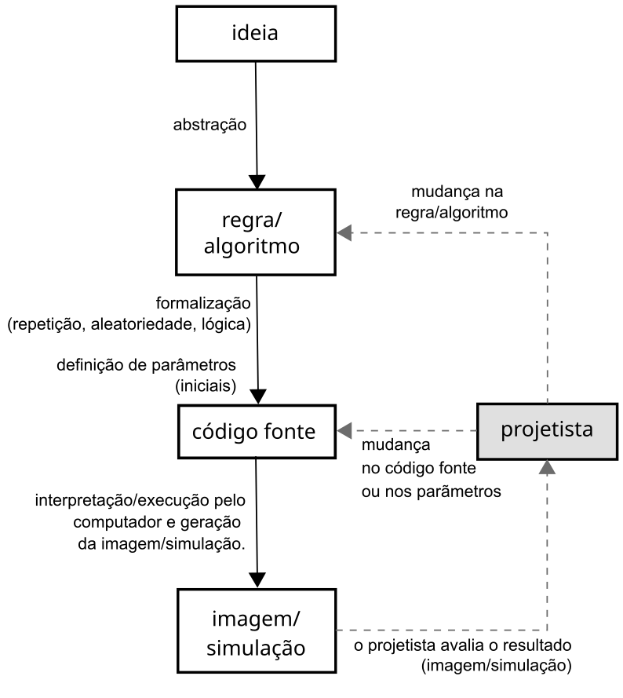
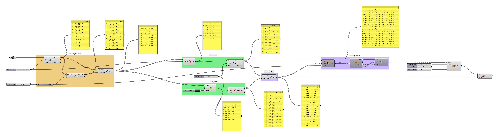
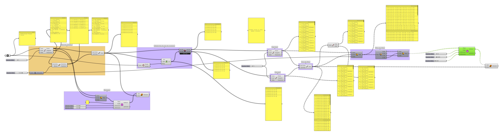

# INTRODUÇÃO À MODELAGEM PARAMÉTRICA

_______

<!-- ## MBI BIM | SENAI-CIMATEC | 2021.2 -->

## Prof. Fernando Ferraz Ribeiro | ffribeiro@gmail.com

_______

<!-- ### [Edital de Avaliação](EdialAvaliacoes/edital01.md) -->

_______

### Introdução - parte 1

1. Interface do Rhinoceros3D  6.x

    - [Introdução](https://255ribeiro.github.io/intro_rhino/)
    - Navegação
    - Abas
    - Comandos
    - [Atalhos](https://255ribeiro.github.io/intro_rhino/atalhosRhino/atalhosRhino.html)

2. [Introdução à Modelagem Paramétrica](slides/Intro_modelagem_param_MBI_BIM.pdf)

_______

### Introdução - parte 2

3. Interface do Grasshopper

   - [Janela do Grasshopper](./gh_interface/gh_inter.md)
   - [Sliders](./Slider/Slider_config.md)
   - [Panels](./Panels/Painel_config.MD)
   - Pontos
   - Vetores
   - Linhas
   - Nurbs
   - Curvas
   - Pipe
   - Listas    

4. Atividade 01 

   - [Sequência de pilares](./gh_pilares/gh_pilares.md)

   - [Grasshopper Exemplos](./gh_exemplos/gh-exemplos.md) 

_______

### Atividade 02 - parte 1

1. [Manipulação de listas](./gh_list_intro/gh_list_basics.md)

  - Seleção de um elemento de uma lista pelo **Índice**
  - Exclusão de um elemento de uma lista pelo **Índice**
  - **Shift List**

1. [Vetores e Planos](./gh_vect_plane/vect_plane_basics.md)

  - Construção - atributos essenciais
  - Extração de atributos (desconstrução)

##### Atividade 02 - Brise Paramétrico - Parte I

 - [Clusters](./gh_clusters/clusters.md)
 - Domínios
 - [Arquivo final](./gh_brise/brise_parametrico_2021.gh)

_______

### Atividade 02 - parte 2

 - Listas - continuação
 - dados booleanos e condicionais

##### Atividade 02 - Brise Paramétrico - Parte II

 - [Arquivo final](./gh_brise/brise_parametrico_2021b.gh)

### Treliças - 03

[Treliças](gh_treliças/trelicas.md)

### Atividade 04 - Morph

 - [Morph](./gh_morph/gh_morph.md)
 - Nurbs
 - Coordenadas UV
 - Domínios
 - Bounding box

### Atividade 05 - Múltiplos pavimentos

 - curvas
 - planos
 - listas
 - domínio
 - sequência

  [Atividade 04 - Múltiplos pavimentos](./gh_multi_pav/gh_multi_pav.md)

  
  [Pavimentos com posição aleatória](gh_multi_pav/random_tower.gh)

### Atividade 06 - Attractors

[Atratores](./gh_attractors/attractors.md)

### Instalando pacotes

[Instalando pacotes no Rhino e Grasshopper](./install_packages/install_packages.md)

### Elefront

[exemplos fluxo de trabalho](./dl_assets/projeto_mpsd.zip)

[exemplos fluxo de trabalho - pt2](./dl_assets/TER_01_terreno_3d_V00.gh)

[exemplos fluxo de trabalho - pt3](./dl_assets/projeto_mpsd/projeto_mpsd/Terreno/TER_02_mov_de_terra_V00.gh)

### Interoperabilidade

[Principais plugins de interoperabilidade](./interop/interop.md)

### Final de curso

 - Dúvidas sobre a avaliação

 - Comentários sobre o curso

_______

### Links

#### Site do Rhinoceros 3D

[Rhino3d](https://www.rhino3d.com/)

#### Comunidade e fórum do Grasshopper

[Grasshopper](https://www.grasshopper3d.com/)

#### Fórum da Mcneel

[fórum](https://discourse.mcneel.com/)

#### Download de Plug-ins

[Food4Rhino](https://www.food4rhino.com/)

#### BIM e Automação de processos construtivos

1. [Conexão Rhinoceros/Grasshopper - Archicad 25 Download](https://graphisoft.com/downloads/addons/interoperability/rhino?#live-connection-plugin)

2. [Rhino.Inside Revit](https://www.food4rhino.com/en/app/rhinoinside-autodesk-revit)

3. [Rhino.Inside Tekla Structures](https://www.food4rhino.com/en/resource/rhinoinside-tekla-structures)

4. [Rhino.Inside Bricscad](https://www.bricsys.com/applications/a/?rhino/grasshopper-connection-for-bricscad-bim-a1353-al2360)

5. [Plug-in Grevit - exportação IFC/revit/Archicad - gratuito](https://www.food4rhino.com/app/grevit-grasshopper-native-bim)
   
6. [speckle.systems](https://speckle.systems/)

7. [Detalhamento e Planilhamento autoático de elementos de fachada utilizando Rhinoceros/Grasshopper e o plug-in Elefront - apresentação do workflow](https://www.youtube.com/watch?v=i1A2fU_H4fA&t=31s)

8. [Plug-in comercial VisualArq - BIM exportação IFC/Revit](https://www.visualarq.com/)

#### Tutoriais gratuitos do Rhino e Grasshopper

1. [Rhino Tutorials](https://www.youtube.com/channel/UCsWpNdwxf0I3ffkedM505xA/featured)

1. [Página de tutoriais do froum do Grasshopper](https://www.grasshopper3d.com/page/tutorials-1)

1. [Modelab Grasshopper Primer](https://aae280.files.wordpress.com/2014/10/mode-lab-grasshopper-primer-third-edition.pdf)

1. [Essential Mathematics for Computational Design](https://discourse.mcneel.com/t/the-essential-mathematics-third-edition/4049)

1. [Essential Algorithms and Data Structures for Grasshopper ](https://www.food4rhino.com/en/resource/essential-algorithms-and-data-structures-grasshopper)

1. [Parametric House](https://www.youtube.com/parametrichouse)

1. [Think Parametric](https://www.youtube.com/c/Thinkparametric)

1. [Introduction to Grasshopper](https://medium.com/intro-to-grasshopper)

1. [Oficina Paramétrica](https://www.youtube.com/@OficinaParametrica)

_______
_______
