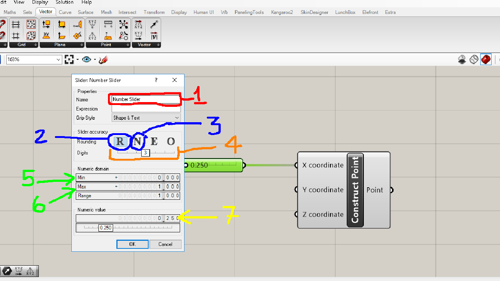

# Sliders

__________

## O que é um slider no Grasshopper

Os sliders são os principais componentes para controlar, aterar e exploara o cunjunto de soluções possíveis para um modelo paramétrico, quando os parâmetros de entrada são **números**.

__________

## Como colocar um slider em um algoritmo no Grasshopper

O componente Slider se localiza na aba **Param**, no painel **Input**, como mostrado na figura acima.

__________

## Partes de um slider

Os sliders podem ser divididos em duas partes. Na primeira temos o nome do slider, na segunda o valor utilizado no fluxo do algoritmo. A maneira mais direta de se alterar o valor de um slider é mover o elemento deslizante na segunda parte do slider.

Os valores também podem ser alterados em um slider clicando na segunda parte, digitando o valor desejado e apertando o botão verde.

__________

## Editando um slider

Para editar um slider, deve-se aplicar um dluplo klick na primeira parte de um slider, abrindo a caixa de diálogo mostrada na figura abaixo, onde os principais campos de edição de um slider estão numerados.

1. Permite alterar o nome de um slider

2. Cria um slider de números reais.

3. Cria um slider de números inteiros (deveria ser o conjunto **Z** ao invéz de **N**)

4. Ajusta o número de casa decimais de um slider Real (fica desabilitado para sliders inteiros)

5. Valor minimo de um slider

6. Valor máximo de um slider

7. Valor utilizado no fluxo do algoritmo

__________
__________