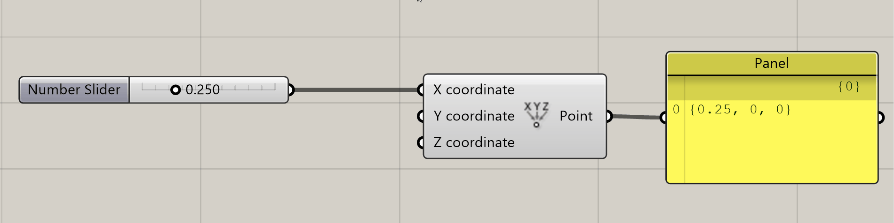

# Sliders

__________

## O que é um slider no Grasshopper

Os sliders são os principais componentes para controlar, aterar e exploara o conjunto de soluções possíveis para um modelo paramétrico quando os parâmetros de entrada são **números**.

__________

## Como colocar um slider em um algoritmo no Grasshopper


O componente Slider se localiza na aba **Param**, na paleta **Input**, como mostrado na figura acima. Nas ilustrações deste guia foram também utilizados os componentes construct Point (aba: vector, paleta: points e componente: Construct Point) e Panel (aba: Param, paleta: Input e componente: Panel).

__________

## Partes de um slider

Os sliders podem ser divididos em duas partes. Na primeira, da esquerda para a direita, temos o nome do slider, na segunda o valor utilizado no fluxo do algoritmo.


 A maneira mais direta de se alterar o valor de um slider é mover o elemento deslizante na segunda parte do slider.

 

Os valores também podem ser alterados em um slider com um duplo clique na segunda parte, digitando o valor desejado e apertando o botão verde ou a tecla ```enter```. Um clique fora da caixa do slider cancela a mudança.


__________

## Editando um slider

Para editar um slider, deve-se aplicar um dluplo click na primeira parte de um slider, abrindo a caixa de diálogo mostrada na figura abaixo, onde os principais campos de edição de um slider estão numerados.


1. Permite alterar o nome de um slider

2. Cria um slider de números reais.

3. Cria um slider de números inteiros (deveria ser o conjunto **Z** ao invéz de **N**)

4. Ajusta o número de casa decimais de um slider Real (fica desabilitado para sliders inteiros)

5. Valor minimo de um slider

6. Valor máximo de um slider

7. Valor utilizado no fluxo do algoritmo

__________

## Atalho para os Sliders

É muito útil utilizar atalhos quando se usa qualquer programa profissionalmente. No **Grasshopper**, quando clicando duas vezes (botão esquerdo) em uma parte vazia da tela, aparece uma caixa de texto onde palavras chave podem ser digitadas.

Na imagem abaixo, digitamos as letras **num**, e vemos, dentre outras opções, o ícone do ** Number Slider**. 


Ainda assim, no caso dos **Sliders**, recebemos as mesmas configurações inicias que receberíamos se tivéssemos usado o ícone na **TAB** **Params**.

Existem formas de utilizar os atalhos do **Grasshopper** para pre-configurar um **Slider**. 

### Digitando 3 valores separados pelo caractere < (menor que)

1. clique duas vezes(botão esquerdo) em um espaço vazio da tela.
2. digite o valor mínimo do **Slider** (pode ser zero ou valores positivos ou negativos)
3. utilize o caractere **<** (menor que) para separar os valores.
4. digite um outro valor. Neste caso, o segundo valor digitado é o valor onde o novo **Slider** aparecerá  configurado na tela.
5. utilize novamente o caractere **<** e digite o valor máximo do **Slider**.
6. Aperte a tecla **enter**.


Se os valores são todos números inteiros, o *Slider* ficará configurado como um número inteiro (marcado pela letra **N** no editor do **Slider**). Para configurar números reais **R** utilize casas decimais em pelo menos um dos valores numéricos. Caso queira que os valores sejam números "redondos", utilize uma sequência de 0(zeros) depois do separador de decimais. Duas casas decimais equivalem a configurar o valor de **Digits** no editor para **2**. Caso os valores tenham número de casas diferentes, a configuração do **Digits** será igual ao número de casas decimais do valor digitados com maior número de casas decimais.

##### Obs: os valores precisam ser digitados em ordem crescente (mínimo < ajuste inicial < máximo).

### Digitando 2 valores separados pelo caractere < (menor que)

Quando digitamos apenas dois valores numéricos, a configuração inicial do **Slider** aparece ajustada para o valor mínimo (primeiro valor digitado).

### Separando valores com 3 pontos (...)

Os valores podem ser separados por ... substituindo o caractere < mantendo a mesma lógica para 3 ou 2 valores digitados.

__________
__________
