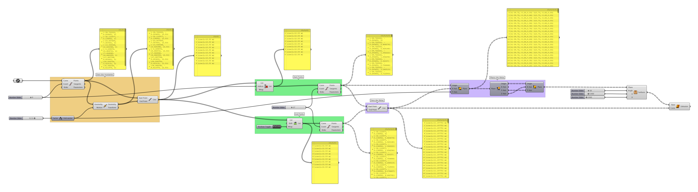
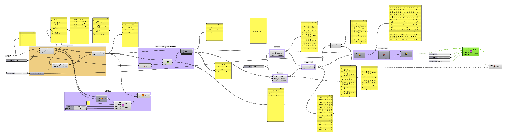

# Brise Paramétrico

## Parte I

- [Clusters](../gh_clusters/clusters.md)
  
- Domínios
  
- [Arquivo final](./brise_parametrico_2021.gh)

### Parte 2

- Listas - continuação
- dados booleanos e condicionais

### Atividade 02 - Brise Paramétrico - Parte II

- [Arquivo final](./brise_parametrico_2021b.gh)