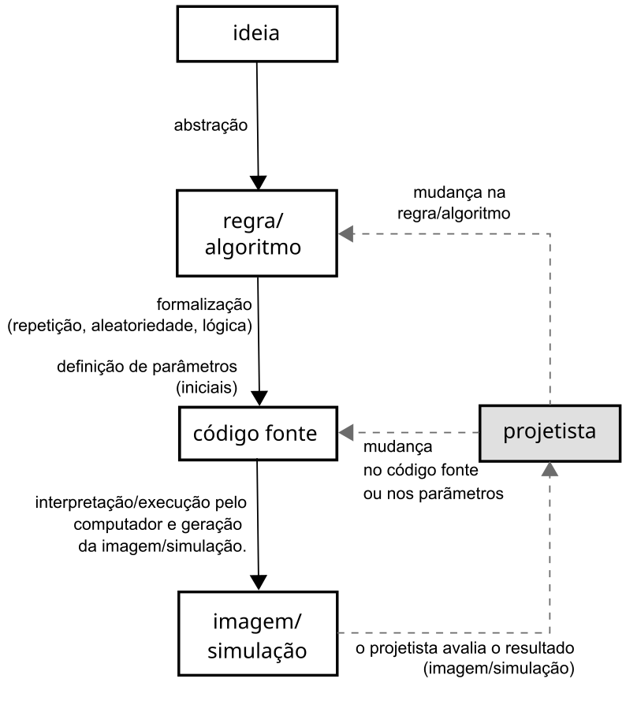

# INTRODUÇÃO À MODELAGEM PARAMÉTRICA

_______

<!-- ## MBI BIM | SENAI-CIMATEC | 2021.2 -->

## Prof. Fernando Ferraz Ribeiro | <ffribeiro@gmail.com>

_______

<!-- ### [Edital de Avaliação](EdialAvaliacoes/edital01.md) -->

_______

### Introdução - parte 1

1. Interface do Rhinoceros3D  6.x

    - [Introdução](https://255ribeiro.github.io/intro_rhino/)
    - Navegação
    - Abas
    - Comandos
    - [Atalhos](https://255ribeiro.github.io/intro_rhino/atalhosRhino/atalhosRhino.html)

2. [Introdução à Modelagem Paramétrica](./slides/Intro_modelagem_param_MBI_BIM.pdf)

_______

### Introdução - parte 2

1. Interface do Grasshopper

   - [Janela do Grasshopper](./gh_interface/gh_inter.md)
   - [Sliders](./Slider/Slider_config.md)
   - [Panels](./Panels/Painel_config.md)
   - Pontos
   - Vetores
   - Linhas
   - Nurbs
   - Curvas
   - Pipe
   - Listas
   -

2. Atividade 01

   - [Sequência de pilares](./gh_pilares/gh_pilares.md)

   - [Grasshopper Exemplos](./gh_exemplos/gh-exemplos.md)

_______

### Atividade 02 - parte 1

1. [Manipulação de listas](./gh_list_intro/gh_list_basics.md)

- Seleção de um elemento de uma lista pelo **Índice**
- Exclusão de um elemento de uma lista pelo **Índice**
- **Shift List**

1. [Vetores e Planos](./gh_vect_plane/vect_plane_basics.md)

- Construção - atributos essenciais
- Extração de atributos (desconstrução)

### Atividade 02 - Brise Paramétrico - Parte I

- [Clusters](./gh_clusters/clusters.md)

- Domínios

- [Arquivo final](./gh_brise/brise_parametrico_2021.gh)

_______

### Atividade 02 - parte 2

- Listas - continuação
- dados booleanos e condicionais

### Atividade 02 - Brise Paramétrico - Parte II

- [Arquivo final](./gh_brise/brise_parametrico_2021b.gh)

### Treliças - 03

[Treliças](./gh_trelicas/trelicas.md)

### Atividade 04 - Morph

- [Morph](./gh_morph/gh_morph.md)
- Nurbs
- Coordenadas UV
- Domínios
- Bounding box

### Atividade 05 - Múltiplos pavimentos

- curvas
- planos
- listas
- domínio
- sequência

  [Atividade 04 - Múltiplos pavimentos](./gh_multi_pav/gh_multi_pav.md)

  [Pavimentos com posição aleatória](./gh_multi_pav/random_tower.gh)

### Atividade 06 - Attractors

[Atratores](./gh_attractors/attractors.md)

### Instalando pacotes

[Instalando pacotes no Rhino e Grasshopper](./install_packages/install_packages.md)

### Elefront

[exemplos fluxo de trabalho](./dl_assets/projeto_mpsd.zip)

[exemplos fluxo de trabalho - pt2](./dl_assets/TER_01_terreno_3d_V00.gh)

[exemplos fluxo de trabalho - pt3](./dl_assets/projeto_mpsd/projeto_mpsd/Terreno/TER_02_mov_de_terra_V00.gh)

### Interoperabilidade

[Principais plugins de interoperabilidade](./interop/interop.md)

### Final de curso

- Dúvidas sobre a avaliação

- Comentários sobre o curso

_______
_______
