# Clusters

[Arquivo base](./CLUSTER_EXAMPLE.gh)

## Criando clusters

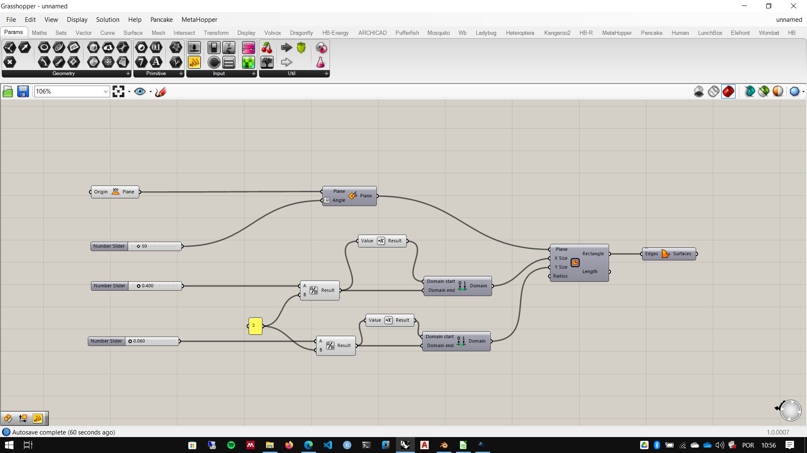

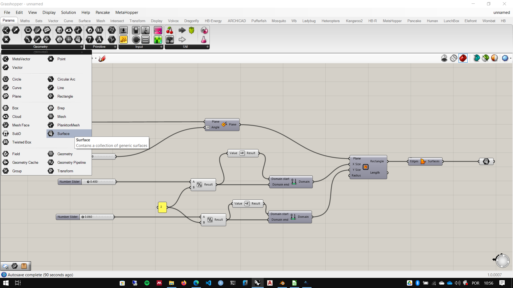

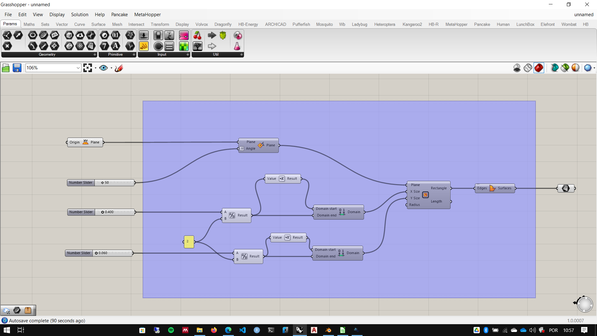

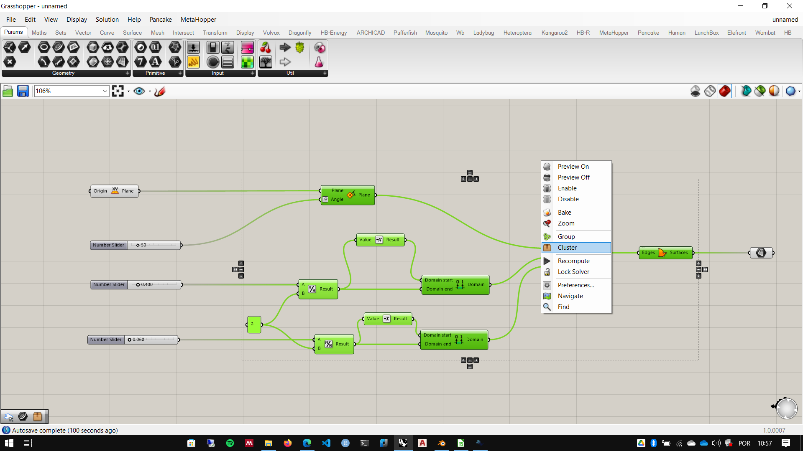

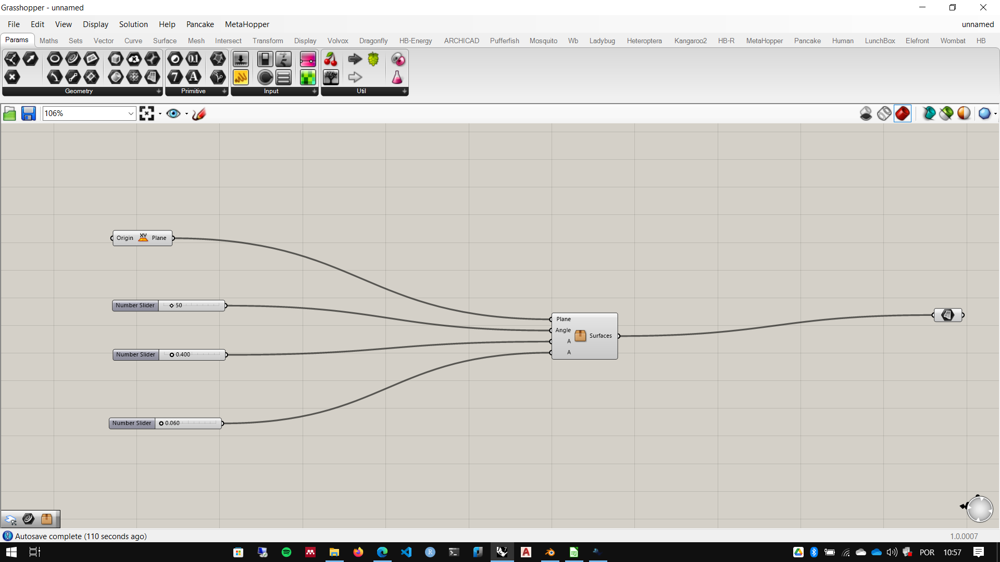

## Editando o cluster

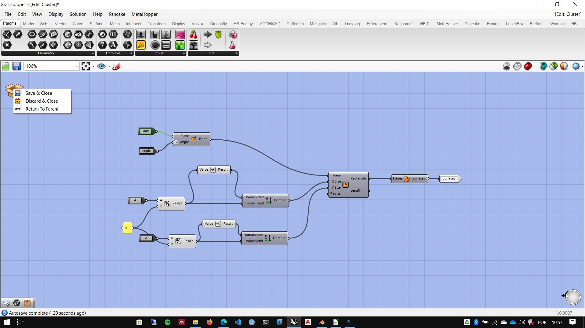

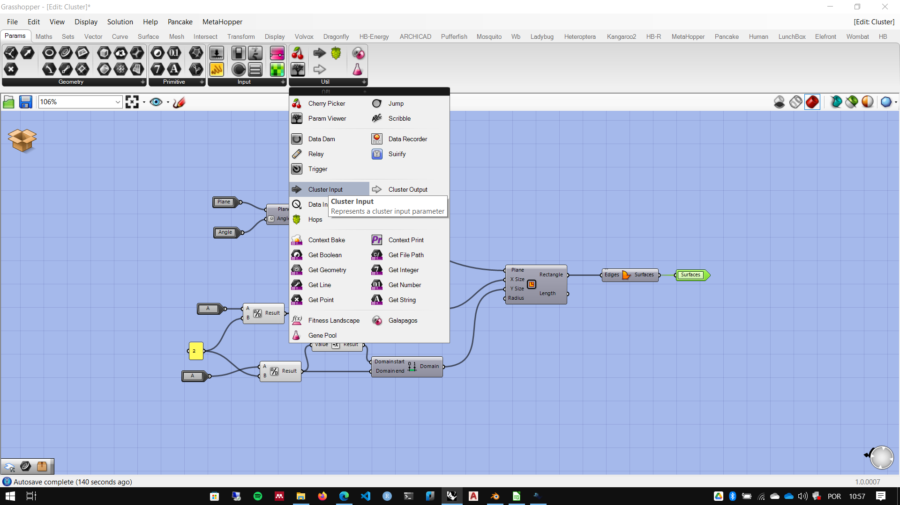

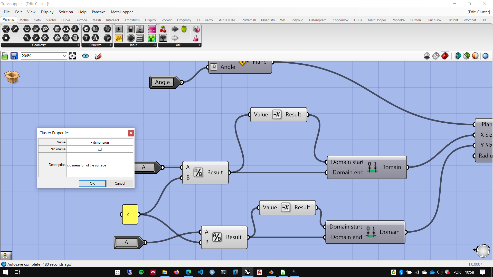

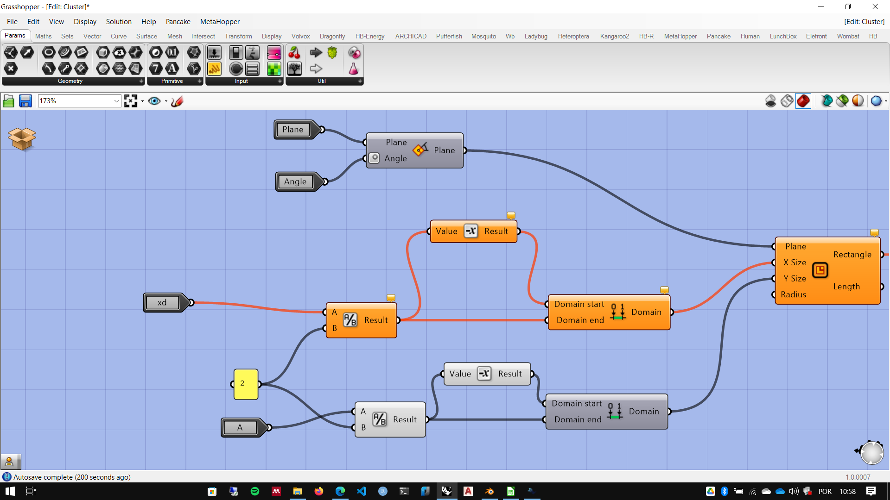

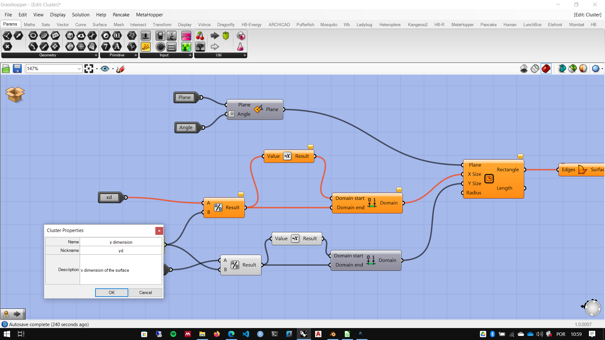

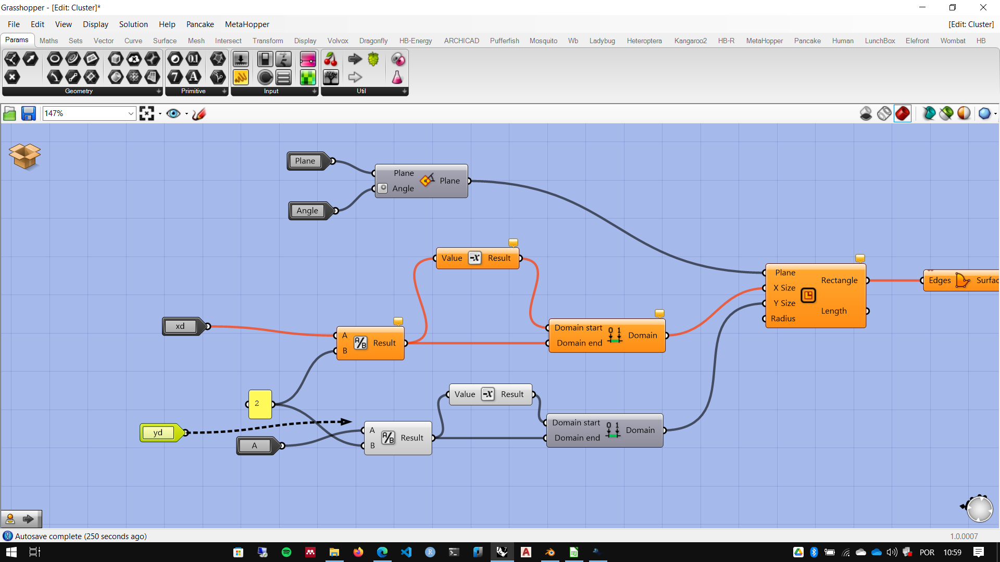

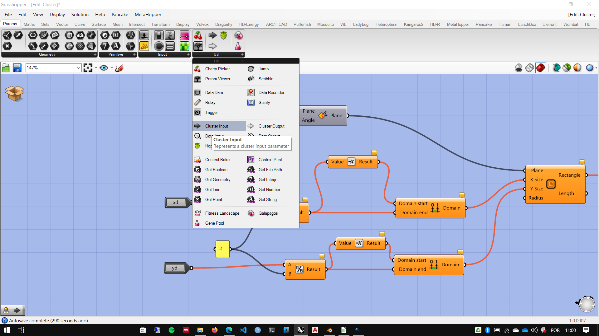

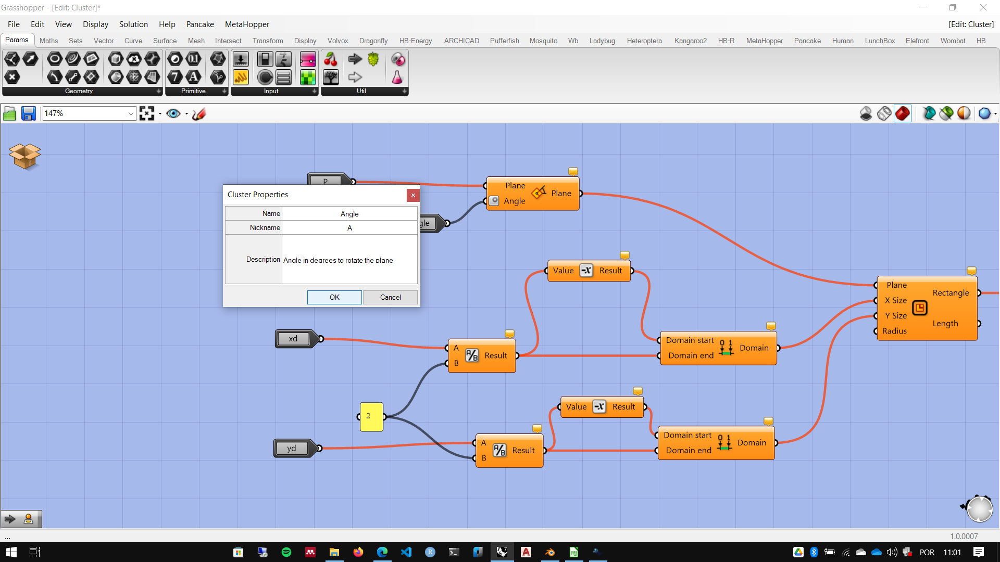

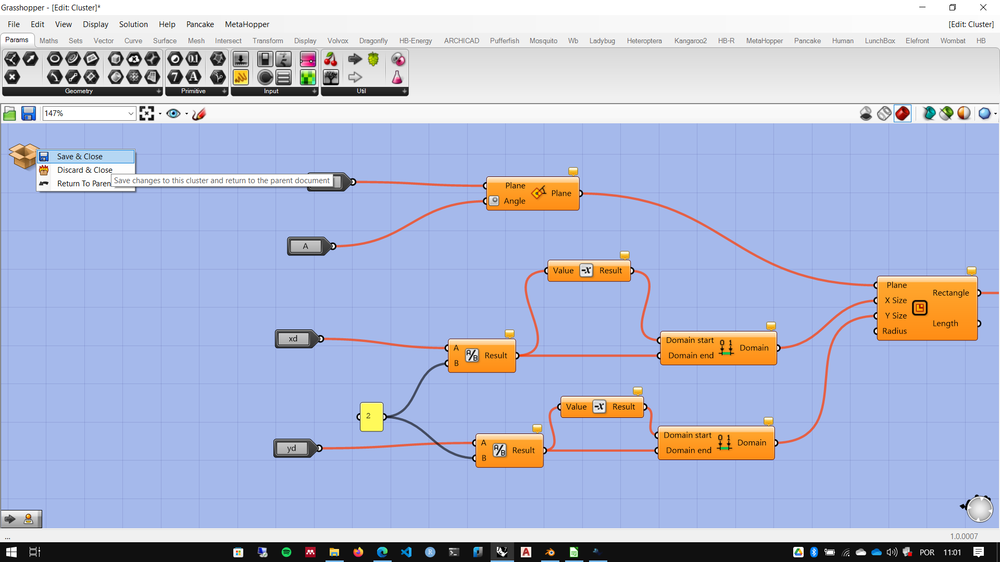

## Colocando um Cluster em uma TAB/Paleta

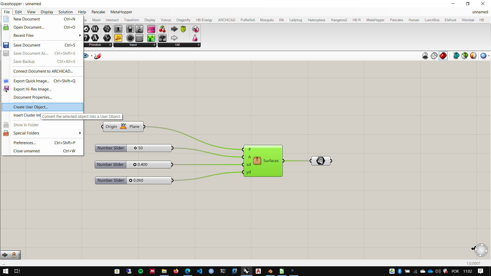

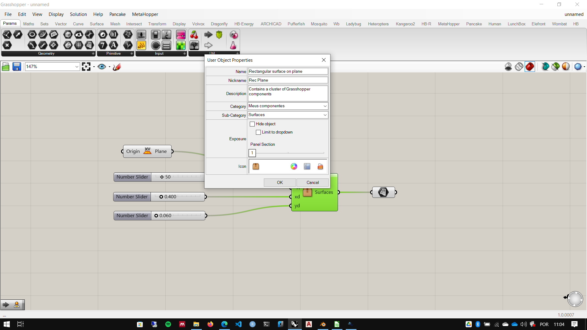

Pode-se escolher um icone personalizado para o seu pacote. Icones gratúitos podem ser baixados em [https://iconify.design/](https://iconify.design/).

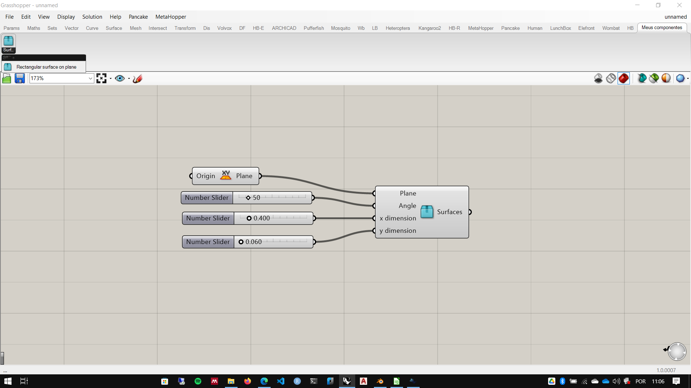

## Onde ficam armazenados os Cluters

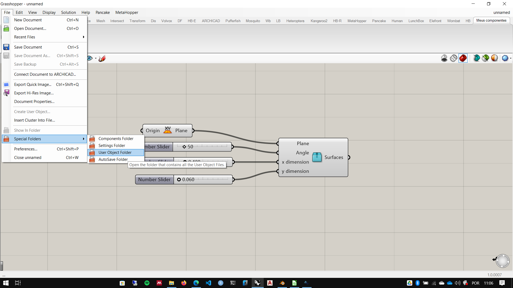
