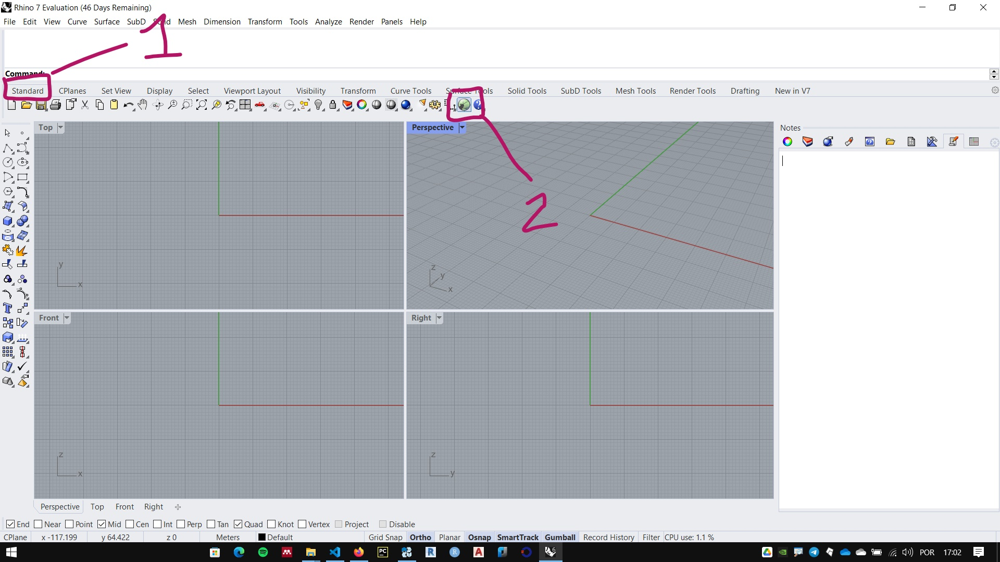
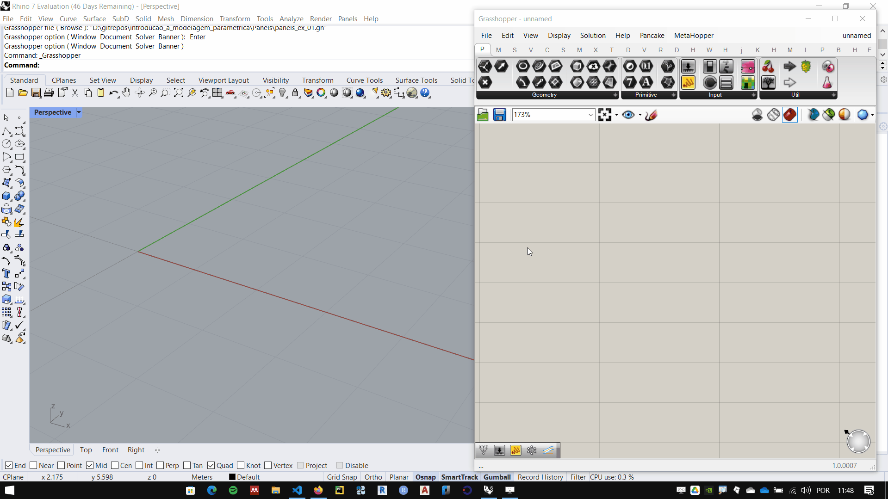
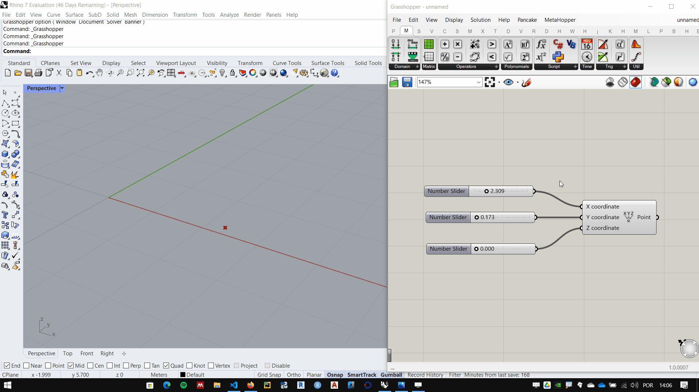

# Interface

_______________
## Abrindo o Grasshopper

Para iniciar o grasshopper, digite **Grasshopper** na linha de comando do **Rhino**, ou clicado no ícone do **Grasshopper** na aba **Standard**, conforme figura abaixo:

____________

## Interface do Grasshopper

1. Main menu
2. Tabs
3. Component palettes.
4. Canvas toolbar
5. Canvas
6. Status bar

Os componetes do **GrasShopper** estão organzados em abas. Cada aba contem um ou mais paletas que abrigam os componentes (as vezes chamados de baterias) do **Grasshopper**.

____________
## Inserindo um componente

Para inserir um componente, procure a aba e o painel do componente. Na figura abaixo utilizamos o componente **Construct Point**, na aba **Vector** paleta **Point**, componente **Construct Point**.

Após clicar no componente, clique em algum lugar da **Canvas** para inserir o componente

Podemos ver o ponto marcado na coordenada 0,0,0 na tela do **Rhino**. Essa marcação é gerada pelo componente. 

_____________________
## Conectando e desconectando componentes

O ponto criado pelo componente **Construct Point** pode ser modificado de diversas maneiras, uma delas é através dos **number sliders**. Inserindo **Sliders** nas entradas das coordenadas do ponto é possível alterar parametricamente a posição do ponto na tela. Para conectar um componente com outro, basta arrastar a saída do primeiro componente para a entrada do componente seguinte

Para desconectar existem 3 maneiras:

1. clicando com o botão direito na entrada que deseja-se desconectar, na opção **disconect** selecionar o componente que deseja-se desconectar.
2. com o botão ctrl apertado, arrastar de um extremo a outro do **wire** que se deseja desconectar.
3. caso deseje-se desconectar um componente pra conectar outro, basta arrastar da entrada para a saída do novo componente sem apertar nenhuma tecla. deste modo, a atual conexão é desfeita e a nova é feita.

___________________

## Dica útil:
### Ctrl + alt + left mouse button hold

Se você quer saber em que aba/paleta um componente usado em um algoritmo se encontra, aperte as teclas Ctrl + ALt e clique e segure o botão esquerdo do mouse sobre o componente. A interface do **Grasshopper** ira mostrar onde o componente se encontra.

___________
___________

