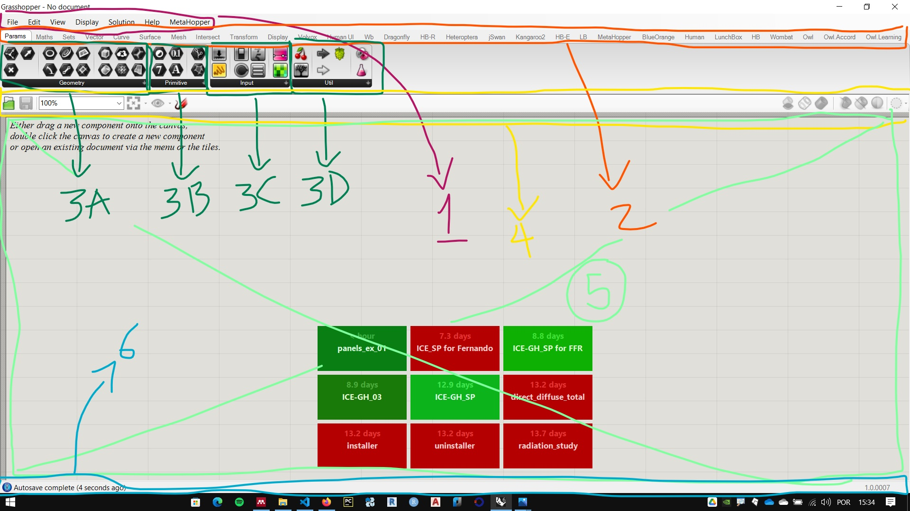
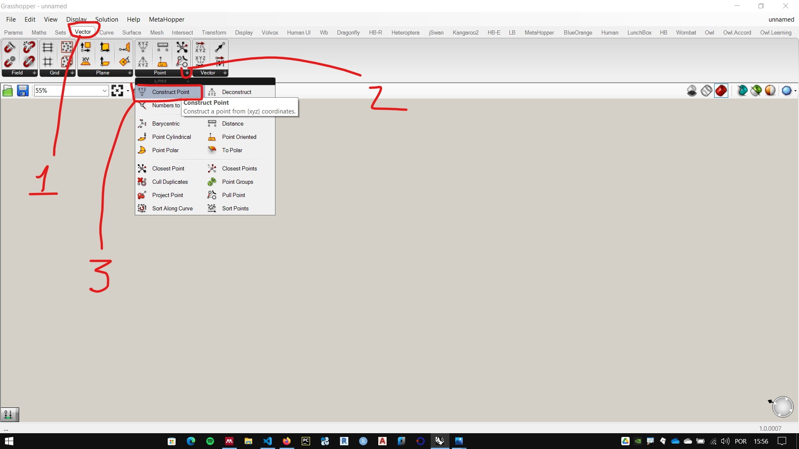
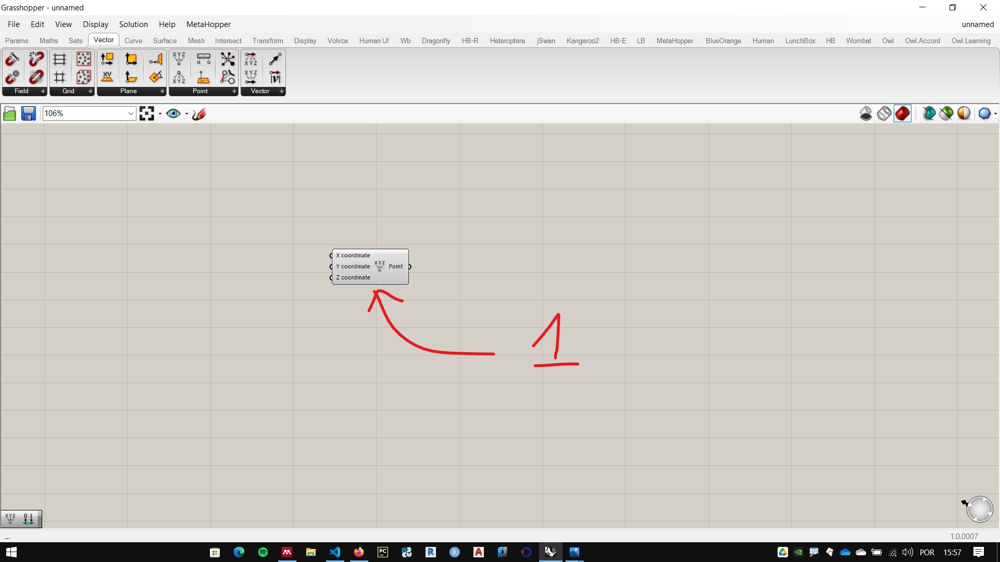
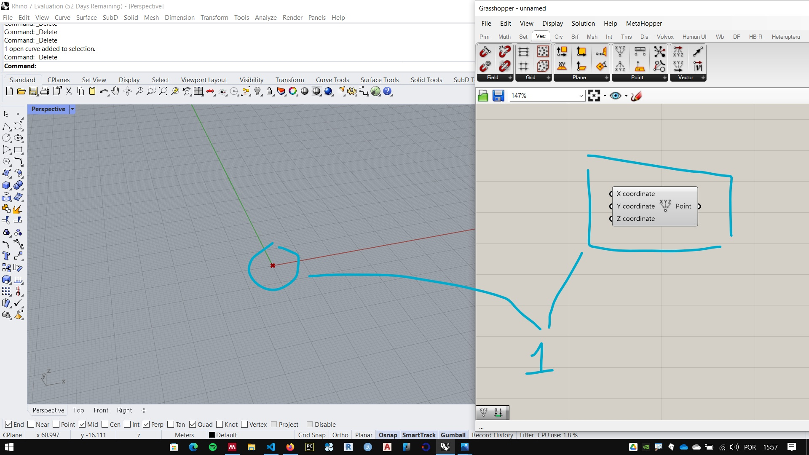
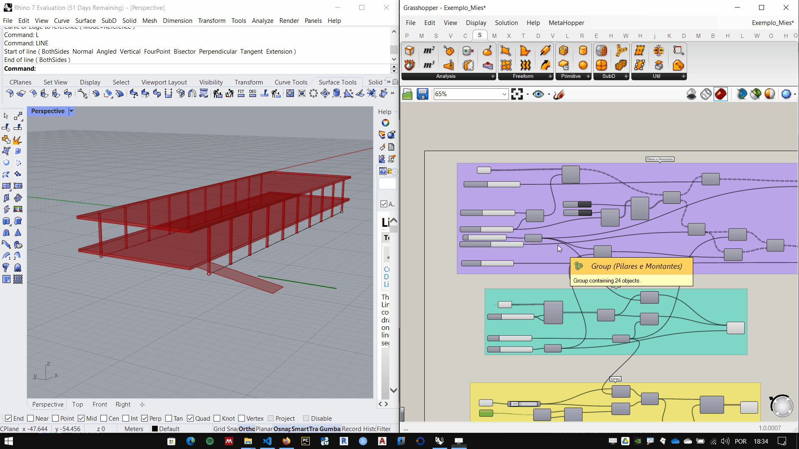

# Interface

_______________
## Abrindo o Grasshopper

Para iniciar o grasshopper, digite **grasshopper** na linha de comando do Rhino.

____________

## Interface do Grasshopper

1. Main menu
2. Tabs
3. Component palettes.
4. Canvas toolbar
5. Canvas
6. Status bar

Os componetes do **GrasShopper** estão organzados em abas. Cada aba contem um ou mais paletas que abrigam os componentes (as vezes chamados de baterias) do **Grasshopper**.

____________
## Inserindo um componente

Para inserir um componente, procure a aba e o painel do componente. Na figura abaixo utilizamos o componente **Construct Point**, na aba **Vector** paleta **Point**, componente **Construct Point**.

Após clicar no componente, clique em algum lugar da **Canvas** para inserir o componente

Podemos ver o ponto marcado na coordenada 0,0,0 na tela do Rhino. Essa marcação é gerada pelo componente. 

___________________

## Ctrl + alt + left mouse hold

Se você quer saber em que aba/subcategoria um componente usado em um algoritmo se encontra, aperte as teclas Ctrl + ALt e clique e segure o botão esquerdo do mouse sobre o componente. A interface do **Grasshopper** ira mostrar onde o componente se encontra.

___________
___________

