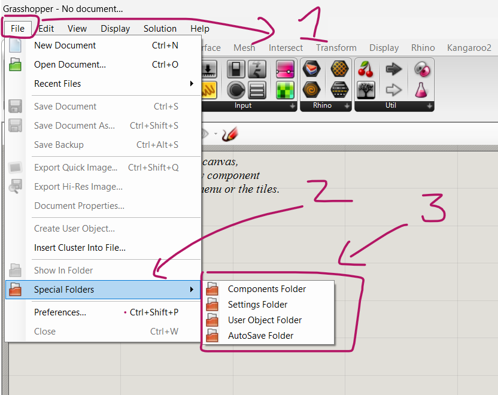

Existem algumas pastas especiais no Grasshopper,

elas podem ser acessadas no Grasshopper no caminho **File**->**Special Folders**



Segue abaixo uma lista dessas pastas com os respectivos atalhos que podem ser copiados diretamente no navegador de arquivos so Windows.

components folder: ```%AppData%\Grasshopper\Libraries``` 
settings folder": ```%AppData%\Grasshopper```
user object folder": ```%AppData%\Grasshopper\UserObjects```
auto save folder": ```%AppData%\Grasshopper\AutoSave```