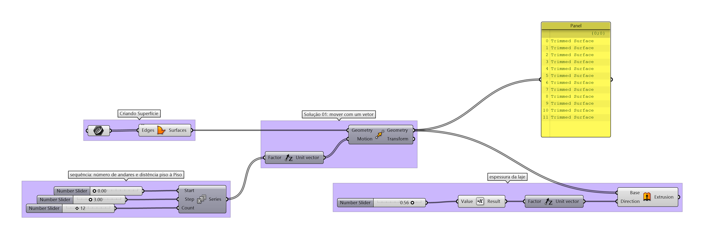
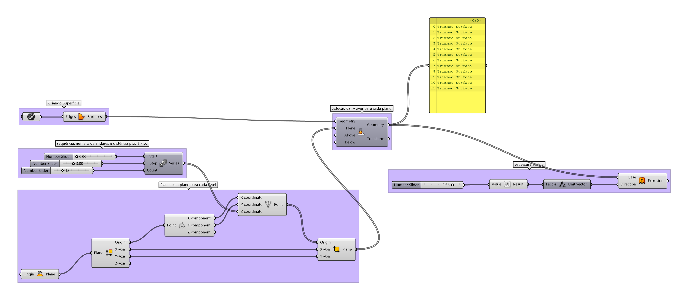

# Múltipos pavimentos

____________
## Solução 01

[arquivo exemplo 01](./multipav_base_op_01.gh)

____________
## Solução 02

[arquivo exemplo 02](./multipav_base_op_02.gh)

____________
## Solução 03

[arquivo exemplo 03](./multipav_base_op_03.gh)

_____________
_____________