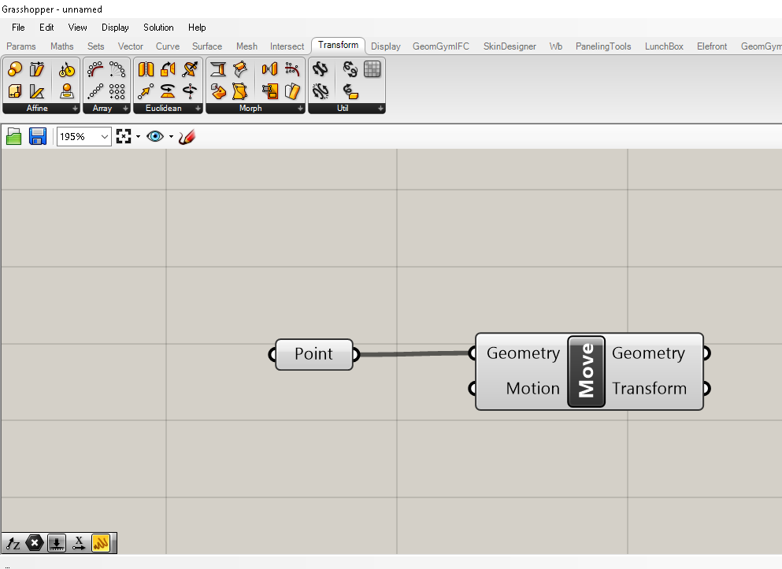
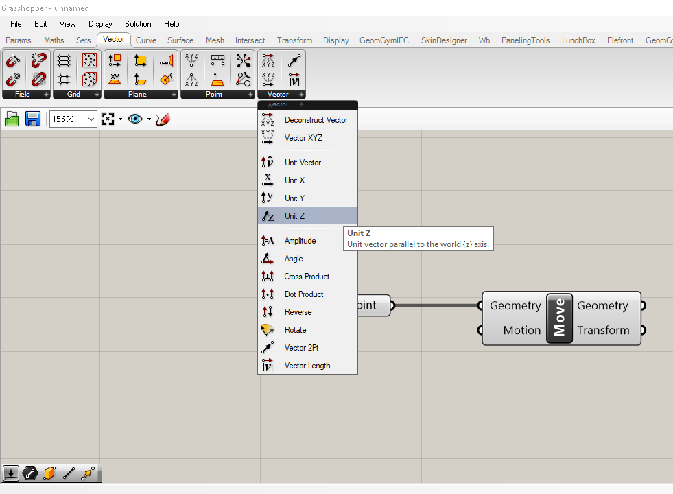
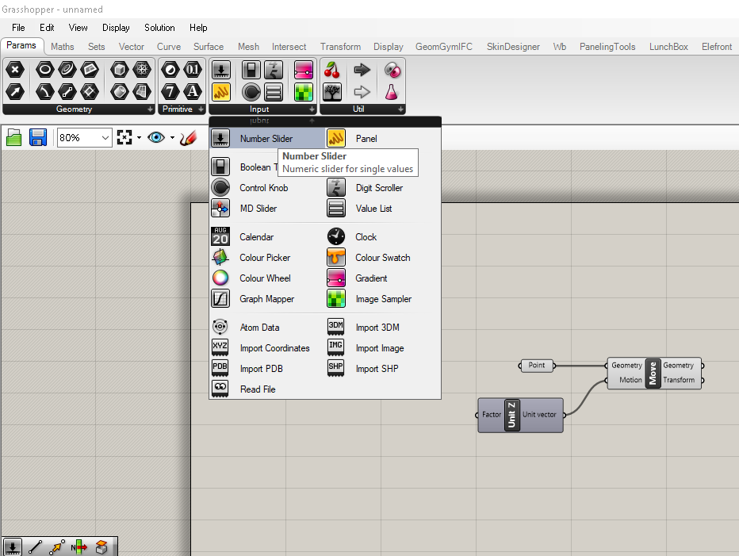
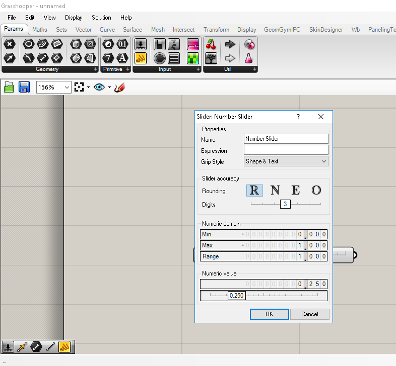
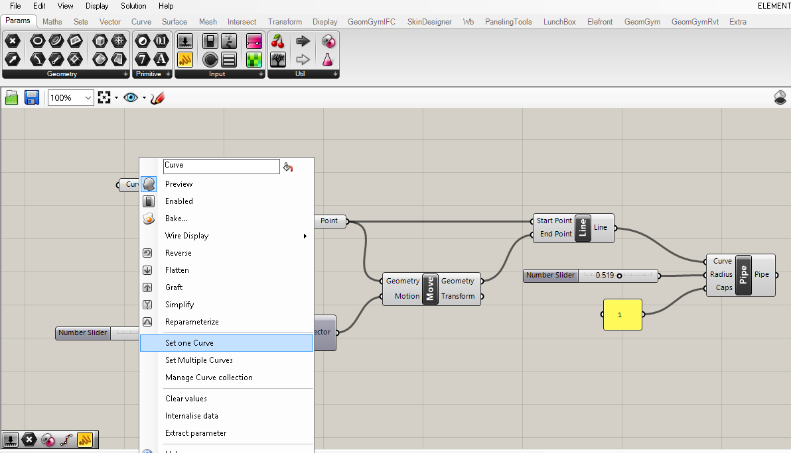
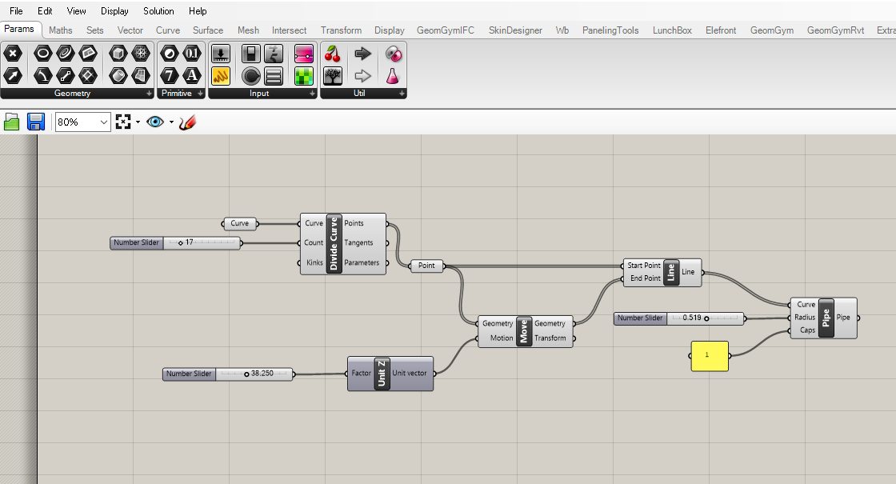

# Grasshopper Introdução - Squência de pilares

_______________

## Iniciando uma definição

[Introdução: Arquivo base](./Grasshopper_introdução.gh)

Para iniciar uma definição no **Grashopper** clique no componete **Point** da aba **Params** no painel **Geometry**. Clique na tela de trabalho(*canvas*) para posicionar o componete no editor de código.

Com o componete **Point** posicionado, clique com o botão direito no componente e sselecione a opção **Set One Point**.

A opção **Set One Point** alterna para a nterface do **Rhino**, permitindo a seleção de um ponto por coordenadas, por um ponto desenhado na interface do **Rhino** ou um ponto sobre uma curva. Caso a opção *Coordinates* não esteja aparecendo na linha de comando, clique sobre o texto **Type** e selecione a opção coordinates.

Com a opção coordinates selecionada, O ponto pode ser selecionado clicando na tela ou digitando as corrdenadas.

Digite as coordeandas 0,0,1 e pressione **enter** para voltar á interface do **Grasshopper**.

Para mover(copiar) o ponto em uma direção sentido e distância específica, clique a aba **Trasnform**, no painel **Euclidean**, selecione o componente **Move**.

Arraste a saida á esquerda do componente **Point** e concete com a entrada **Geometry** do componente **Move**. Com isso o ponto será movido na distância e direção *default* do componente (10 unidades na direção do eixo Z).

### Definindo Direção de Distância

Para definir uma direção, na aba **Vector**, no painel **Vector**, selecione o componente **Unit Z**. conecte a saida do componente a entrada **Motion** do componente **Move**.

O componente **Unit Z** é um versor (vetor unitário) na direção Z. Para definir a distância, na aba **Params**, no painel **Input** selecione a opção **Slider**.

Com um clique duplo na parte esquerda do **Slider**, altere o valor da opção **MAx** para 100 e clique em **Ok**. Conecte a saída do **Slider** na entrada do componente **Unit Z**.

### Criando uma Linha Entre os Pontos

Na aba **Curve**, no painel **Primitive**, selecione o componente **Line**. Conecte a saída do componente **Point** na entrada **Start Point** do componente **Line** e a saída **Geometry** do componente **Move** na entrada **End Point** do componente **Line**.

### Criando uma Coluna (Elemento Tubular) a Partir de uma Linha

Na aba **Surface**, no painel **Freeform**, selecione o componente **Pipe**. Concete a saída do componente **Line** na entrada **Curve** do componente **Pipe**. Conecte um **Slider** na entrada **Radius** do componente **Pipe**. Na entrada **Cap** do componente **Pipe**, clique com o botão direito e selecione a opção **Flat**.

### Criando Colunas a Partir de uma Curva

Na interface do **Rhinoceros** desenhe um segmento de reta (line) ou uma curva.

Na aba **params**, no painel **Geometry**, selecione o componente **Curve**.

Clique com o botão direito no componente e selecione a curva na interface do **Rhinoceros** clicando sobre a curva desenhada.

Na aba **Curve**, no painel **Division** selecione o componente **Divide Curve**.

Conecte a saída do componente **Curve** na entrada **Curve** do componente **Divide Curve**.

Na aba **Params**, no painel **Input** selecione a opção **Slider**.

Com um clique duplo na parte esquerda do **Slider**, altere o valor da opção **R** para **N** e a opção **Max** para 100 e clique em **Ok**.

![slider int 2]./(sliderInt2.jpg)

Conecte a saída do **Slider** com a entrada **Count** do componente **Divide Curve**.

Conecte a saída **Points** do componente **Divide Curve** á entrada do componente **Point**.

Algoritmo final

[Download](./seq_pilares_final.gh) do arquivo do exemplo

## Outros exemplos

[Elementos tubulares uma Curva](./ELEMENTOS_TUBULARES_UMA_CURVA.gh)

[Elementos tubulares duas Curvas](./ELEMENTOS_TUBULARES_DUAS_CURVAS.gh)

[Exemplo Janelas](./exemplo_janela.gh)

[Guarda Corpo](./GUARDA-CORPO.gh)

[Exemplo Mies](./Exemplo_Mies_rhino7.gh)

[Exemplo Python](https://github.com/jonasbarbosa/trabalhofinalLPACAF)
