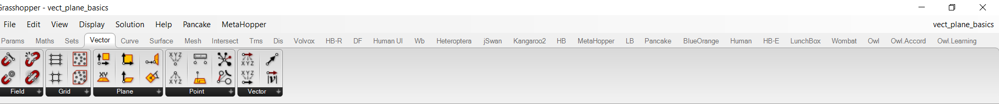
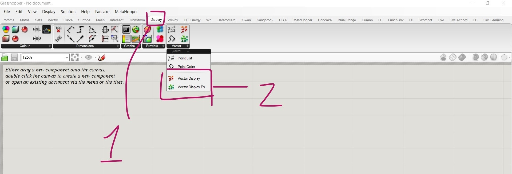
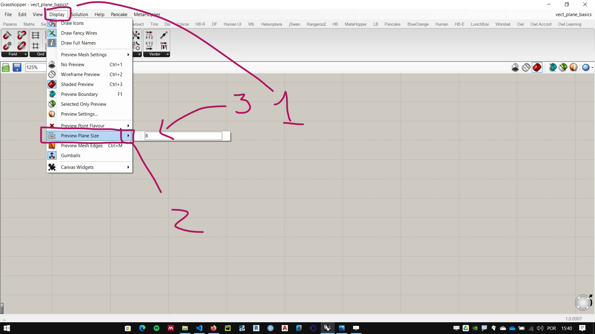
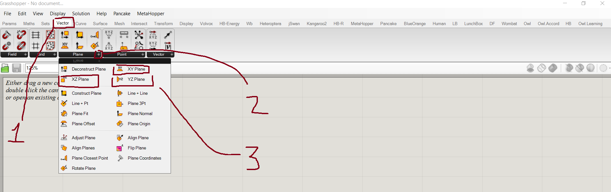

# Pontos, Vetores e Planos

[Arquivo exemplo](./vect_plane_basics.gh)

## Vetores e Pontos

### Elementos de um vetor
    - Módulo ou Magnitude
    - Direção
    - Sentido

### Coordenadas dos pontos e componentes de um vetor

Como pontos e vetores são representados no plano cartesiano.

### Visualizando vetores no Grasshopper

### Operações com vetores e pontos
   - soma
   - subtração
   - produto vetorial ( cross product)

## Planos

### Ajustando a visualização dos planos 

### Planos principais (XY, XZ e YZ)

### Criando planos através origem e vetores

