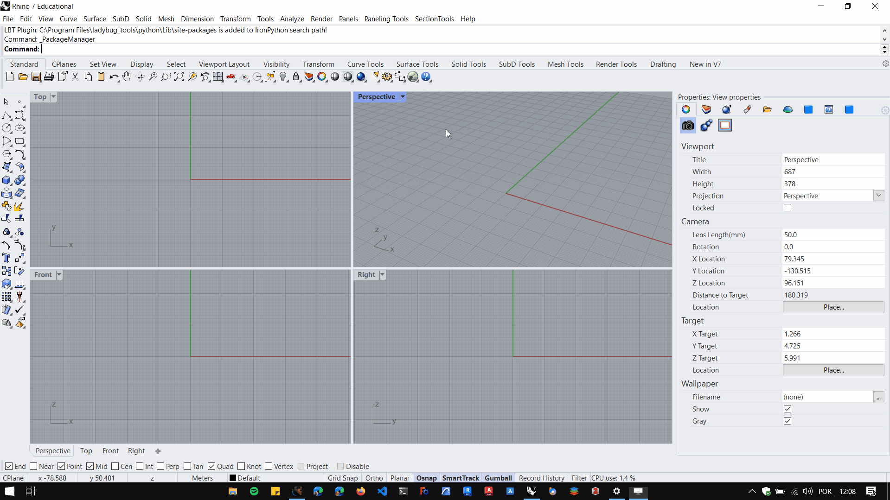

# Instalando pacotes pelo package manager

Instalando pacotes pelo package manager. (disponível a partir do Rhino 7)

Abra o package manager do Rhino em ```Tools -> package manager```, ou digite ```packagemanager``` na linha de comando ( digite ```_packagemanager``` se sua instalação do Rhino não estiver em inglês.

Pesquise o pacote desejado,selecione e clique em instalar.

Após a instalação é preciso reiniciar o Rhino.

Exemplo: Istalando o pacote Mesh edit components:


