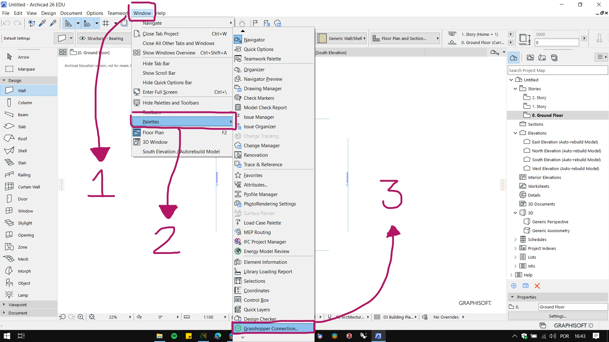

# Grasshopper – ArchiCAD Live Connection

O primeiro passo para instalar o **Grasshopper – ArchiCAD Live Connection** é garantir que o **ArchiCAD** esta atualizado.

## Atualização do ArchiCAD

Antes de instalar o **Grasshopper – ArchiCAD Live Connection**, é preciso atualizar o ArchiCAD. No menu ```Help```, procure a opção ```Check for Updates```:


Essa ação vai abrir o navegador de internet na página de download dos pacotes de atualização da sua versão do **ArchiCAD**. Baixe a última atualização disponível para o seu sistema operacional e instale.

## Instalação

Baixe a versão mais nova para o seus sistema operacional do Grasshopper – ArchiCAD Live Connection no site abaixo e siga as instruções de instalação.
[https://graphisoft.com/downloads/addons/interoperability/rhino](https://graphisoft.com/downloads/addons/interoperability/rhino)

No link acima também é possível baixar um manual de utilização do **ArchiCAD - Grasshopper live connect**. Os manuais são muito infirmativos e constantemente atualizados para as mudanças de cada versão.

## Verificando a instalação:

Após a instalação, abra o **ArchiCAD** e verifique se o plug-in aparece no gerenciador de extensões. Clique em ```Options -> Add On Manager```.


Verifique se o **Grasshopper – ArchiCAD Live Connection** aparece na lista de **Add Ons** instalados.


A paleta do **Grasshopper** pode ser aberta em ```Windows -> Palettes -> Grasshopper Connection```



No **Rhinoceros v7**, Abra o **Grasshopper** conforme instruções abaixo e verifiquei se aparece um menu **"ArchiCAD"** na tela do **Grasshopper**.

