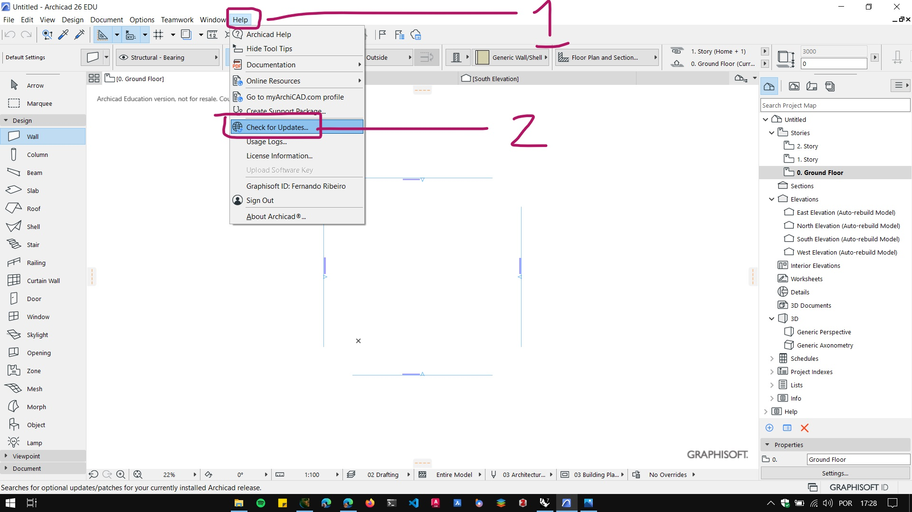
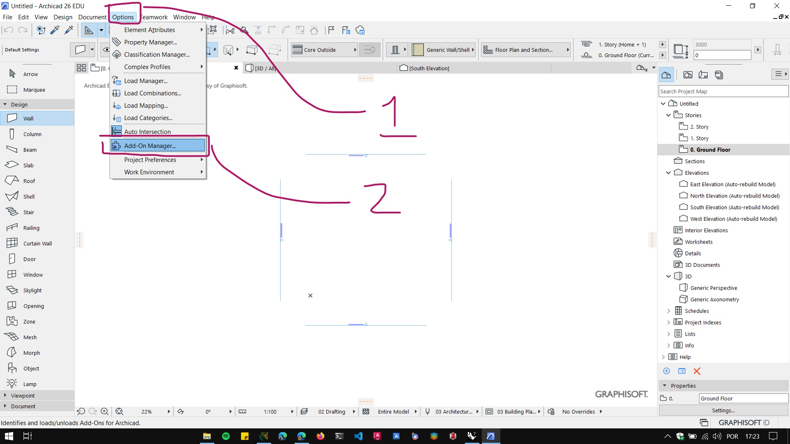
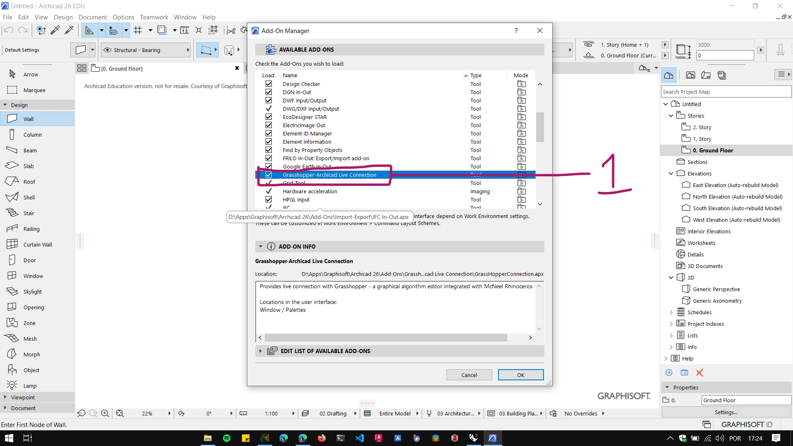
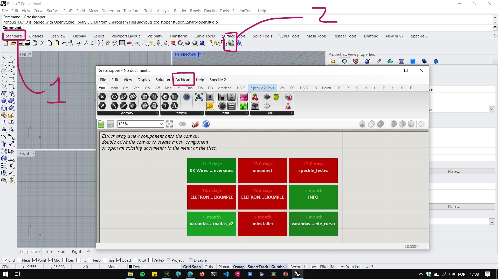

## Grasshopper – Archicad Live Connection

### Atualização do Archicad

Antes de instalar o **Grasshopper – Archicad Live Connection**, é preciso atualizar o Archicad. No menu ```Help```, procure a opção ```Check for Updates```:



Essa ação vai abrir o navegador de internet na página de download dos pacotes de atualização da sua versão do **Archicad**. Baixe a última atualização disponível para o seu sistema operacional e instale.

### Instalação

Baixe a versão mais nova para o seus sistema operacional do Grasshopper – Archicad Live Connection no site abaixo e siga as instruções de instalação.
[https://graphisoft.com/downloads/addons/interoperability/rhino](https://graphisoft.com/downloads/addons/interoperability/rhino)

No link acima também é possível baixar um manual de utilização do **Archicad - Grasshopper live connect**. Os manuais são muito infirmativos e constantemente atualizados para as mudanças de cada versão.

### Verificando a instalação:

Após a instalação, abra o **Archicad** e verifique se o plug-in aparece no gerenciador de extensões. Clique em ```Options -> Add On Manager```.



Verifique se o **Grasshopper – Archicad Live Connection** aparece na lista de **Add Ons** instalados.



No **Rhinoceros**, Abra o **Grasshopper** conforme instruções abaixo e verifiquei se aparece um menu **"Archicad"** na tela do **Grasshopper**.

