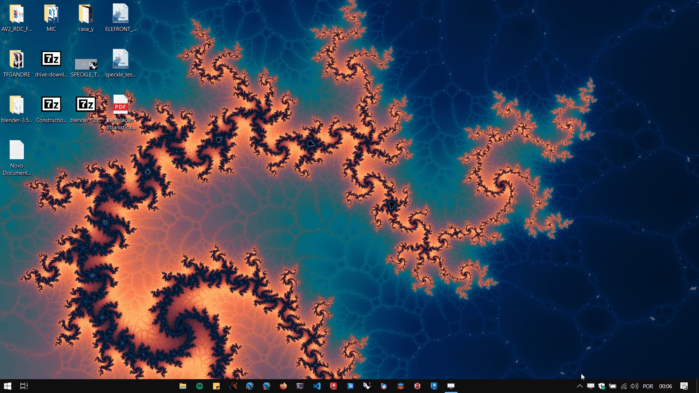

# Instalando o Speckle

E preciso instalar o Speckle Manager e os conectores para cada um dos programas que se pretende usar.

## Rede e firewall

É preciso garantir que a sua rede/firewall não esteja boqueando o acesso aos sites:

[https://speckle.systems/](https://speckle.systems/)

e

[https://speckle.xyz/](https://speckle.xyz/)

## Instalado o Speckle Manager

Acesse o site [https://speckle.xyz/](https://speckle.xyz/) e faça uma conta no servidor Speckle.

No site abaixo:
[https://speckle.systems/download/](https://speckle.systems/download/)

Baixe e instale o Speckle Manager.

Após a instalação, é preciso abrir o programa (área de notificações do Windows) e instalar os conectores. O gif abaixo mostra a instalação do conector do Archicad através do Speckle Manager.

### Para este curso, precisamos usar os seguintes conectores:

- Rhino
- Grasshopper
- Revit
- Dynamo
- Archicad

_________________
_________________

